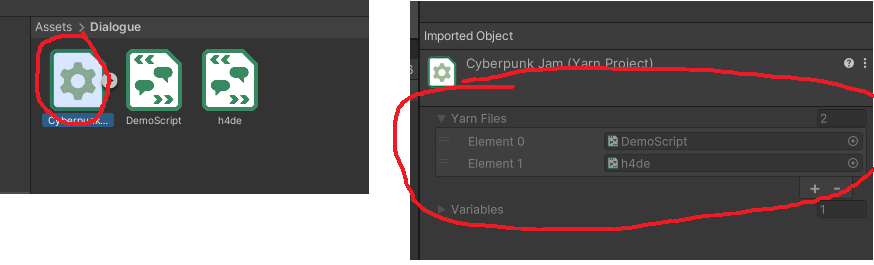

# CyberPunkGameJam

## Dependencies
- YarnSpinner; there are paid packages on the asset store but they have instructions to install the free build as well [here](https://docs.yarnspinner.dev/beginners-guide/making-a-game/yarn-spinner-for-unity#install-via-the-unity-package-manager)

## Writing in YarnSpinner
- You can experiment with it their [online editor](https://try.yarnspinner.dev/)
- A comprehensive guide to writing in Yarn is [here](https://docs.yarnspinner.dev/getting-started/writing-in-yarn)
    - If you use VSCode you can install [the extension](https://docs.yarnspinner.dev/getting-started/editing-with-vs-code/previewing-your-dialogue) which makes the online editor available locally

## YarnSpinner in our Jam

**Functions**
- `reset` -- this unloads the left+right characters and sets the Background to the "no-signal" screen
- `loadBG <path>` -- takes a path to a background image and sets it; we'll discuss how to add background images in a bit
- `loadLeft <path>`, `loadRight <path>` -- loads a left or right image into the character slot
- `unloadLeft`, `unloadRight` -- makes the left or right character slot empty
- `fadeIn <time_sec>`, `fadeOut <timeSec>` -- fades a scene in or out in a set amount of time
- `wait <time_sec>` -- waits a specific amount of time

Indicating you would like to call a function in the script is done by `<<function_name args>>`. If
there are no args you can omit them and just `<<function_name>>`. Multiple args are space separated.

**Adding new art**  
All the paths above get loaded from a `Resources` directory; see `Art/Resources/Bar/BarBG1`
as an example. To add new art drag it into the Project in the place you want it saved. Because
of our current config it _should_ get treated as a Sprite by default.

When loading new art with `loadBG`, `loadLeft`, `loadRight` or any other new functions
provide a path that is relative to `Resources/` e.g. in the example above you would use:
`<<loadBG "Bar/BarBG1">>`.

**Editing scripts**  
Start by checking out the sample script I have in place. This includes examples of: function calls, dialogue,
choices, scene jumps, loading characters, setting/referencing variables.

The scripts are:
- DemoScript.yarn
- h4de.yarn

From there you can find examples and a full walkthrough in the YarnSpinner docs [here](https://docs.yarnspinner.dev/getting-started/writing-in-yarn).

Right now the Bar scene will automatically start playing at the `Begin` node. If you want you can swap that node to something like the following to debug without starting playing the whole thing from the beginning.

```
title: Begin
---
<<set $any_variables_you_need = "whatever">>
<<jump TheNodeYoureExperimentingWith>>
===
```

**Adding new scripts**  
Currently all script files live under Dialogue. When you add a new one it needs to be recognized
by the `CyberpunkJam.yarnproject` asset. If you click on it and check the inspector it will tell
you which script files are loaded:



If you add a new script and it doesn't show up right click the yarnproject
and reimport it:

.

